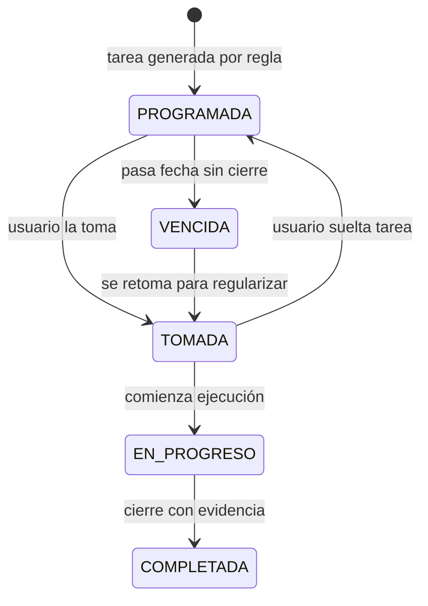

# Plan Módulo Cronograma de Trabajo por Empresa

Fecha: 2026-08-04
Estado: Borrador funcional (base para iterar con el tío)

> Documento vivo para aterrizar la nueva función de Cronograma.
> Objetivo: dejar claridad funcional y técnica antes de implementar.

---

## 1) Qué se quiere construir (resumen claro)

Crear un módulo nuevo visible como tarjeta en Home (zona azul), similar al patrón de módulos actuales, para gestionar cronogramas de tareas pauteadas por empresa cliente.

Cada empresa cliente tendrá tareas planificadas (inspecciones, chequeos, capacitaciones, etc.) que:

1. Se generan según una frecuencia (por ejemplo mensual).
2. Pueden ser tomadas por un responsable para evitar choques.
3. Se completan dejando trazabilidad de quién, cuándo y qué hizo.
4. Deben poder abrir el módulo destino correspondiente (si existe).
5. Si no existe módulo destino, deben abrir una pantalla genérica/checklist base.

Además, se quiere integrar mejoras relacionadas con Tickets:

1. Cambiar color cuando fecha tentativa de cierre esté próxima.
2. Alertas/notificaciones para cierre de tickets.
3. Vincular tickets a una tarea de cronograma realizada.

---

## 2) Contexto importante del sistema actual

Hallazgos del repositorio para no romper la arquitectura existente:

1. Los módulos del Home se registran en `ModuleRegistry` y se habilitan por empresa vía `empresa_modulos`.
2. Existe una tabla principal `empresas` (multi-empresa app), y también entidades de otros dominios (ej. buceo/contratistas) con su propia lógica.
3. El módulo Cronograma debe usar entidades de negocio propias para "empresa cliente de cronograma" y no mezclarse automáticamente con empresas del sistema si el negocio lo exige.

---

## 3) Decisiones preliminares (propuestas, no cerradas)

1. Crear módulo nuevo con `moduleKey` sugerido: `CRONOGRAMA_EMPRESAS`.
2. Mantener activación por `empresa_modulos` (igual que el resto).
3. Crear tablas nuevas exclusivas para cronograma (sin reutilizar directamente las de `empresas` o `contratistas` para el cliente final).
4. Diferenciar explícitamente estados de tarea: programada, tomada, en progreso, completada, vencida.
5. Separar "tomar tarea" de "completar tarea" en historial.
6. Definir en cada tipo de tarea el destino de navegación (`target_module_key` o `GENERIC_CHECKLIST`).

---

## 4) Preguntas abiertas (las tuyas + extras para evitar suposiciones)

### 4.1 Preguntas ya definidas por ti

1. ¿El cronograma será solo para Aquachile o para todas las empresas/usuarios?
2. ¿Conviene generar tickets automáticamente al finalizar inspección o mantener el flujo semimanual actual?

### 4.2 Preguntas adicionales recomendadas para cerrar diseño

1. ¿Quién puede crear/editar cronogramas: solo tu tío, admins, o también supervisores?
2. ¿Una tarea puede tener más de un responsable simultáneo o solo uno?
3. ¿Qué pasa si una tarea vence sin completarse: se reprograma sola, se duplica, o queda vencida hasta cierre manual?
4. ¿Se permite completar una tarea fuera de fecha con motivo obligatorio?
5. ¿Las notificaciones deben ser solo in-app o también push (con app cerrada)?
6. ¿La frecuencia mínima necesaria en MVP: mensual, semanal, quincenal, anual?
7. ¿Se necesita plantilla de tareas por rubro (ej. extintores) para crear cronogramas más rápido?
8. ¿Se quiere evidencia obligatoria al cerrar tarea (comentario/foto/documento)?
9. ¿La tarea completada debe crear ticket automáticamente cuando detecta hallazgo o solo por botón manual?
10. ¿Una tarea puede vincularse a más de un módulo destino?

---

## 5) Modelo funcional propuesto (MVP)

## 5.1 Entidades de negocio

1. Empresa de Cronograma (cliente objetivo, independiente del dominio buceo/contratistas).
2. Plantilla de Tarea (tipo, parámetros, frecuencia, módulo destino).
3. Cronograma (conjunto de tareas planificadas para una empresa y periodo).
4. Tarea Programada (instancia concreta con fecha y estado).
5. Toma de Tarea (quién la tomó y cuándo).
6. Ejecución de Tarea (evidencia de cierre: qué hizo, cuándo, resultado).
7. Historial de Tarea (bitácora completa de eventos).

## 5.2 Ciclo de vida sugerido

## 5.3 Historial mínimo por evento

Cada evento debería registrar:

1. `tarea_id`
2. `accion` (CREADA, TOMADA, SOLTADA, INICIADA, COMPLETADA, REABIERTA, VENCIDA)
3. `usuario_id`
4. `fecha_hora`
5. `comentario`
6. `payload_json` (datos extra, opcional)

---

## 6) Diseño de datos inicial (boceto SQL)

Nombres tentativos para no confundir con `empresas` actuales:

1. `cronograma_clientes_empresas`
2. `cronograma_tipos_tarea`
3. `cronograma_planes`
4. `cronograma_plan_tareas`
5. `cronograma_tareas_programadas`
6. `cronograma_tareas_historial`
7. `cronograma_tareas_evidencias`

Campos clave sugeridos:

1. `cronograma_clientes_empresas`
   - `id`, `nombre`, `rut`, `activo`, `created_at`
2. `cronograma_tipos_tarea`
   - `id`, `codigo`, `nombre`, `target_module_key`, `usa_pantalla_generica`, `activo`
3. `cronograma_plan_tareas`
   - `id`, `plan_id`, `tipo_tarea_id`, `frecuencia` (MENSUAL/SEMANAL/etc), `desde`, `hasta`, `dia_mes`, `parametros_json`
4. `cronograma_tareas_programadas`
   - `id`, `plan_tarea_id`, `cliente_empresa_id`, `fecha_programada`, `estado`, `tomada_por_id`, `tomada_at`, `completada_por_id`, `completada_at`, `resultado_json`
5. `cronograma_tareas_historial`
   - `id`, `tarea_programada_id`, `accion`, `usuario_id`, `comentario`, `created_at`, `payload_json`

Nota: la relación con Tickets puede resolverse con un campo opcional en tickets:

- `tickets.cronograma_tarea_id` (nullable, FK a tarea programada)

---

## 7) Navegación y UX del módulo

## 7.1 Home

1. Tarjeta nueva "Cronograma" (cuadradito en zona azul de módulos).
2. Badge opcional: tareas pendientes del mes / vencidas.

## 7.2 Pantallas mínimas MVP

1. Lista de empresas de cronograma.
2. Vista de cronograma por empresa (calendario/lista mensual).
3. Detalle de tarea (tomar, soltar, iniciar, completar, historial).
4. Formulario de creación de plan (admin/tío).
5. Pantalla puente para abrir módulo destino o checklist genérico.

## 7.3 Estados visuales recomendados

1. Programada: gris/azul suave.
2. Tomada: azul.
3. En progreso: ámbar.
4. Próxima a vencer: naranja.
5. Vencida: rojo.
6. Completada: verde.

---

## 8) Integración con Tickets (mejoras solicitadas)

## 8.1 Color por cercanía de fecha tentativa de cierre

Regla sugerida:

1. Verde: faltan más de 3 días.
2. Naranja: faltan entre 1 y 3 días.
3. Rojo: vencido o vence hoy.

## 8.2 Alertas de cierre

1. Notificación al responsable cuando faltan 3 días.
2. Recordatorio el día anterior.
3. Alerta de vencido al pasar la fecha.

## 8.3 Vínculo Ticket <-> Tarea cronograma

1. Desde tarea completada: opción "Crear/Vincular Ticket".
2. Desde ticket: mostrar "Tarea origen" si existe vínculo.
3. Reportabilidad: poder filtrar tickets nacidos desde cronograma.

---

## 9) Investigación de tipos de tarea (para diseñar plantillas)

Tipos de tarea iniciales recomendados:

1. Inspección periódica (extintores, equipos, instalaciones).
2. Capacitación periódica.
3. Reunión de seguridad/comité.
4. Auditoría documental.
5. Seguimiento de hallazgos anteriores.
6. Mantenimiento preventivo.

Parámetros base por tipo:

1. Frecuencia (`MENSUAL`, `SEMANAL`, etc).
2. Ventana de vigencia (desde/hasta).
3. Día objetivo (ej. día 5 de cada mes).
4. Módulo destino.
5. Evidencia obligatoria (sí/no y tipo).

---

## 10) Plan de implementación por fases

## Fase 0 - Definición con tu tío

1. Cerrar preguntas abiertas de sección 4.
2. Confirmar catálogo inicial de tipos de tarea.
3. Confirmar si alcance es global o solo una empresa al inicio.

## Fase 1 - Base de datos y módulo base

1. Migración SQL para tablas `cronograma_*`.
2. Registro del módulo `CRONOGRAMA_EMPRESAS`.
3. Habilitación por `empresa_modulos`.

## Fase 2 - Flujo operativo mínimo

1. Crear empresa cliente de cronograma.
2. Crear plan con tarea recurrente mensual.
3. Generar tareas programadas.
4. Tomar y completar tarea con historial.

## Fase 3 - Navegación y checklist genérico

1. Enlace a módulo destino por tarea.
2. Fallback a pantalla genérica cuando no exista módulo.

## Fase 4 - Integración con Tickets

1. Color por cercanía de fecha tentativa.
2. Alertas in-app.
3. Vinculación ticket-tarea.

---

## 11) Riesgos y mitigaciones

1. Mezclar empresas de cronograma con empresas del sistema actual: mitigación con tabla separada (`cronograma_clientes_empresas`).
2. Duplicación de tareas recurrentes: mitigación con índice único por (`plan_tarea_id`, `fecha_programada`).
3. Conflicto por toma simultánea: mitigación con update condicional (patrón Tickets).
4. Falta de trazabilidad: mitigación con historial obligatorio por acción.

---

## 12) Definición de éxito (MVP)

Se considera MVP listo cuando:

1. Tu tío/admin puede crear una empresa cliente de cronograma.
2. Puede definir al menos una tarea mensual por empresa.
3. El sistema genera automáticamente instancias mensuales.
4. Un usuario puede tomar y completar una tarea dejando evidencia e historial.
5. La tarea abre su módulo destino o checklist genérico.
6. Se puede vincular al menos un ticket a una tarea completada.

---

## 13) Próximo paso recomendado inmediato

Tomar este documento y convertir la sección 4 en acta de decisiones con tu tío.
Cuando esas respuestas estén cerradas, se crea el archivo de migración SQL inicial del módulo Cronograma (fase 1).
