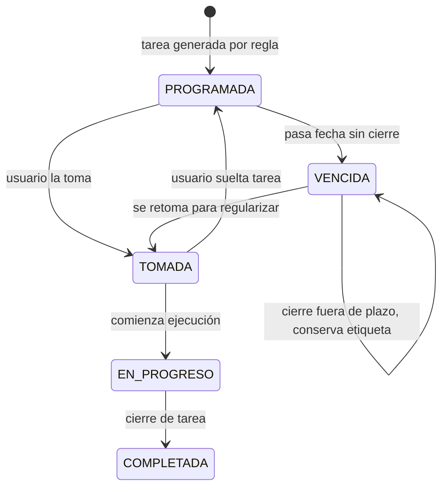

# Plan Módulo Cronograma de Trabajo por Empresa

Fecha: 2026-08-13
Estado: En progreso de definicion (alcance MVP actualizado, sin implementar)

> Documento vivo para aterrizar la nueva función de Cronograma.
> Objetivo: dejar claridad funcional y técnica antes de implementar.

---

## 1) Qué se quiere construir (resumen claro)

Crear un módulo nuevo visible como tarjeta en Home (zona azul), similar al patrón de módulos actuales, para gestionar cronogramas de tareas pauteadas por empresa cliente.

Cada empresa cliente tendrá tareas planificadas (inspecciones, chequeos, capacitaciones, etc.) que:

1. Se generan según una frecuencia (por ejemplo mensual).
2. Pueden ser tomadas por un responsable para evitar choques.
3. Se completan dejando trazabilidad de quién, cuándo y qué hizo.
4. Deben poder abrir el módulo destino correspondiente (si existe).
5. Si no existe módulo destino, deben abrir una pantalla genérica/checklist base.

Además, se quiere integrar mejoras relacionadas con Tickets, algunas dentro
del trabajo inmediato y otras sujetas a confirmación:

1. Cambiar color cuando fecha tentativa de cierre esté próxima.
2. Alertas/notificaciones para cierre de tickets.
3. Vincular tickets a una tarea de cronograma realizada, pendiente de decidir
   con Jorge si será manual, automático o un desglose dentro de la inspección.
4. Dejar preparada la trazabilidad para futuros resúmenes y métricas, sin
   incluir todavía dashboards dentro del MVP operativo.

---

## 2) Contexto importante del sistema actual

Hallazgos del repositorio para no romper la arquitectura existente:

1. Los módulos del Home se registran en `ModuleRegistry` y se habilitan por empresa vía `empresa_modulos`.
2. Existe una tabla principal `empresas` (multi-empresa app), y también entidades de otros dominios (ej. buceo/contratistas) con su propia lógica.
3. El módulo Cronograma debe usar entidades de negocio propias para "empresa cliente de cronograma" y no mezclarse automáticamente con empresas del sistema si el negocio lo exige.

---

## 3) Decisiones tomadas para el MVP

1. Crear un módulo nuevo con `moduleKey`: `CRONOGRAMA_EMPRESAS`.
2. Mantener la activación por `empresa_modulos`. La visibilidad del módulo
   seguirá dependiendo de la empresa del sistema, mientras que la visibilidad
   de cada cronograma se asignará mediante relaciones propias del módulo.
3. Crear tablas propias para cronograma, sin reutilizar directamente las
   tablas de `empresas` o `contratistas` para la empresa cliente del plan.
4. Una empresa de cronograma podrá tener varios cronogramas y un usuario podrá
   ver cronogramas de varias empresas de cronograma.
5. Los super admin podrán crear y administrar cronogramas. Jorge tendrá una
   excepción persistible mediante el permiso `CRONOGRAMA_ADMIN`, aunque no sea
   super admin. No se hardcodeará su nombre en la app.
6. Diferenciar explícitamente estados: `PROGRAMADA`, `TOMADA`, `EN_PROGRESO`,
   `COMPLETADA` y `VENCIDA`.
7. Una tarea solo tendrá un responsable activo a la vez. Se podrá tomar y
   soltar; cada acción quedará en el historial con usuario y fecha.
8. Una tarea vencida podrá completarse posteriormente, pero conservará la
   etiqueta `VENCIDA` y registrará que fue completada fuera de plazo.
9. Las frecuencias preestablecidas serán: diaria, semanal, quincenal,
   mensual, trimestral, semestral y anual. También habrá periodo
   personalizado. El anual usará por defecto del 1 de enero al 31 de
   diciembre; el mensual permitirá elegir el mes/configuración objetivo.
10. Una tarea recurrente se definirá como, por ejemplo, "inspección de
   extintores", con una frecuencia y un contexto de ejecución. La generación
   permitirá trabajar sobre "esta semana", "semana pasada" o una semana
   elegida; y sobre "este mes", "mes pasado" o un mes elegido. Estos filtros
   corresponden a la consulta/generación de instancias, no reemplazan la
   frecuencia configurada en la tarea.
11. Se podrán duplicar plantillas y planes para no comenzar desde cero.
12. Cada tarea tendrá destino `target_module_key` o `GENERIC_CHECKLIST`.
13. Una tarea de inspección deberá permitir asociar la inspección realizada
   antes de completarse. La inspección será el vínculo intermedio hacia los
   tickets relacionados.
14. Toda creación, edición, toma, liberación, inicio, vencimiento,
    regularización y finalización tendrá registro auditable.

---

## 4) Preguntas pendientes para Jorge

1. ¿Los tickets se generarán automáticamente al finalizar una inspección o
   mediante un botón/manual? La relación prevista es
   `tarea -> inspeccion -> tickets`.
3. ¿Se desean notificaciones in-app, push, ambas o ninguna? Se deja fuera del
   MVP, pero la base de datos reservará un diseño compatible con una futura
   bandeja de notificaciones.
4. ¿Qué usuarios adicionales, aparte de super admin y Jorge, podrán crear o
   editar cronogramas en el futuro?
5. ¿Qué indicadores y gráficos debe mostrar el resumen de cumplimiento por
   empresa y por usuario? Se implementará en una fase posterior.

Las siguientes decisiones quedan fijadas para no bloquear el MVP:

6. Una tarea vencida solo conservará la etiqueta `VENCIDA`; no se agregará
   todavía una obligación de motivo ni una regla nueva de evidencia.
7. Los dashboards de cronograma y las métricas de Tickets quedan fuera del
   flujo operativo inicial. Las métricas existentes de Tickets por área no se
   modificarán.

---

## 5) Modelo funcional propuesto (MVP)

## 5.1 Entidades de negocio

1. Empresa de Cronograma (cliente objetivo, independiente del dominio buceo/contratistas).
2. Grupo de Usuarios de Cronograma (por ejemplo, grupo Aquachile).
3. Miembros del Grupo (usuarios agregados o quitados individualmente).
4. Plantilla de Tarea (tipo, parámetros, frecuencia, módulo destino).
5. Cronograma (conjunto de tareas planificadas para una empresa y periodo).
6. Tarea Programada (instancia concreta con fecha y estado).
7. Asociación Tarea-Inspección (inspección ejecutada desde la tarea).
8. Toma de Tarea (quién la tomó y cuándo).
9. Ejecución de Tarea (evidencia de cierre: qué hizo, cuándo, resultado).
10. Historial de Tarea (bitácora completa de eventos).
11. Dashboard administrativo de cumplimiento por empresa, periodo y usuario,
   reservado para una fase posterior.
12. Métricas de Tickets por usuario y estado, reservadas para una fase
   posterior.

## 5.2 Ciclo de vida sugerido

## 5.3 Historial mínimo por evento

Cada evento debería registrar:

1. `tarea_id`
2. `accion` (CREADA, TOMADA, SOLTADA, INICIADA, COMPLETADA, REABIERTA, VENCIDA)
3. `usuario_id`
4. `fecha_hora`
5. `comentario`
6. `payload_json` (datos extra, opcional)

El evento de finalización conservará `fecha_programada`, `fecha_completada`,
`completada_fuera_de_plazo` y, cuando corresponda, el motivo de
regularización. Soltar una tarea y volver a tomarla generará dos o más eventos
independientes; no se sobrescribirá la historia anterior.

---

## 6) Diseño de datos inicial (boceto SQL)

Nombres tentativos para no confundir con `empresas` actuales:

1. `cronograma_clientes_empresas`
2. `cronograma_grupos_usuarios`
3. `cronograma_grupo_usuarios`
4. `cronograma_tipos_tarea`
5. `cronograma_plantillas`
6. `cronograma_plantilla_tareas`
7. `cronograma_permisos`
8. `cronograma_planes`
9. `cronograma_grupo_planes`
10. `cronograma_usuario_planes`
11. `cronograma_plan_tareas`
12. `cronograma_tareas_programadas`
13. `cronograma_tareas_historial`
14. `cronograma_tareas_evidencias`
15. `cronograma_tarea_inspecciones`

Campos clave sugeridos:

1. `cronograma_clientes_empresas`
   - `id`, `nombre`, `rut`, `activo`, `created_at`, `updated_at`
2. `cronograma_tipos_tarea`
   - `id`, `codigo`, `nombre`, `target_module_key`, `usa_pantalla_generica`,
     `evidencia_config_json`, `activo`, `created_at`, `updated_at`
3. `cronograma_grupos_usuarios`
   - `id`, `nombre`, `descripcion`, `activo`, `created_by`, `created_at`,
     `updated_at`
4. `cronograma_grupo_usuarios`
   - `id`, `grupo_id`, `usuario_id`, `activo`, `created_by`, `created_at`
5. `cronograma_plantillas`
   - `id`, `nombre`, `descripcion`, `activo`, `created_by`, `created_at`,
     `updated_at`
6. `cronograma_plantilla_tareas`
   - `id`, `plantilla_id`, `tipo_tarea_id`, `nombre`, `frecuencia`,
     `config_periodo_json`, `parametros_json`, `orden`
7. `cronograma_permisos`
   - `id`, `usuario_id`, `permiso_key` (`CRONOGRAMA_ADMIN`), `activo`,
     `created_by`, `created_at`
8. `cronograma_planes`
    - `id`, `cliente_empresa_id`, `nombre`, `desde`, `hasta`, `activo`,
       `created_by`, `created_at`, `updated_at`
   - El plan podrá asociarse a uno o más grupos de usuarios mediante la tabla
     de acceso, sin limitar al usuario a una sola empresa o cronograma.
9. `cronograma_grupo_planes`
   - `id`, `plan_id`, `grupo_id`, `activo`, `created_by`, `created_at`
10. `cronograma_usuario_planes`
   - `id`, `plan_id`, `usuario_id`, `activo`, `created_by`, `created_at`
11. `cronograma_plan_tareas`
   - `id`, `plan_id`, `tipo_tarea_id`, `nombre`, `frecuencia`, `desde`, `hasta`,
     `config_periodo_json`, `parametros_json`, `activo`
12. `cronograma_tareas_programadas`
   - `id`, `plan_tarea_id`, `cliente_empresa_id`, `fecha_programada`,
     `estado`, `tomada_por_id`, `tomada_at`, `completada_por_id`,
     `completada_at`, `completada_fuera_de_plazo`, `motivo_regularizacion`,
     `resultado_json`, `created_at`, `updated_at`
13. `cronograma_tareas_historial`
   - `id`, `tarea_programada_id`, `accion`, `usuario_id`, `comentario`,
     `created_at`, `payload_json`
14. `cronograma_tareas_evidencias`
   - `id`, `tarea_programada_id`, `tipo`, `url`, `comentario`, `created_by`,
     `created_at`

15. `cronograma_tarea_inspecciones`
   - `id`, `tarea_programada_id`, `inspeccion_id`, `created_by`, `created_at`

La pantalla de administración de acceso mostrará los miembros del grupo
seleccionado y permitirá quitar miembros o agregar usuarios específicos. Al
guardar, se persistirán las relaciones resultantes en
`cronograma_grupo_planes` y `cronograma_usuario_planes`; no se guardará solo
el nombre visible del grupo.

Nota: la relación con Tickets puede resolverse con un campo opcional en tickets:

- `tickets.cronograma_tarea_id` (nullable, FK a tarea programada)

### 6.1 Reglas técnicas de base de datos

1. La migración será idempotente y se ejecutará en Supabase antes de activar
   la pantalla. No se crearán tablas locales `_pendientes` para el MVP si el
   módulo se mantiene online, siguiendo el patrón actual de Tickets.
2. Se activará RLS en todas las tablas. Un usuario verá tareas solo de las
   empresas de cronograma que tenga asignadas; super admin y usuarios con
   `CRONOGRAMA_ADMIN` podrán administrar según su alcance.
3. La toma usará un `UPDATE` condicional que solo permita tomar si la tarea
   está `PROGRAMADA` o `VENCIDA` y no tiene responsable activo. Así gana el
   primer usuario ante una toma simultánea.
4. Se agregará un índice único sobre
   (`plan_tarea_id`, `fecha_programada`) para impedir tareas duplicadas.
5. Las membresías de grupos no se duplicarán por (`grupo_id`, `usuario_id`),
   y los accesos directos no se duplicarán por (`plan_id`, `usuario_id`).
6. La generación de periodos será repetible: calculará fechas faltantes y
   usará `ON CONFLICT DO NOTHING` o equivalente. No duplicará instancias al
   abrir varias veces la pantalla.
7. Una tarea podrá asociar la inspección ejecutada mediante
   `cronograma_tarea_inspecciones`; la relación conservará la inspección
   existente y sus tickets, sin duplicar tickets en el cronograma.
8. Triggers o funciones SQL actualizarán `updated_at` y podrán registrar
   vencimientos. La app también podrá ejecutar una sincronización de estados
   al consultar el periodo, sin depender de un proceso de fondo permanente.
9. Las bitácoras no tendrán `UPDATE` ni `DELETE` para usuarios normales.
   Serán append-only y cada fila conservará el `usuario_id` real del evento.
10. La excepción de Jorge se administrará por UUID en `cronograma_permisos`,
   nunca por nombre, correo fijo o condición codificada en Flutter.
11. Se dejará una tabla futura de notificaciones desacoplada del flujo
    operativo, o una clave de extensión en el diseño, para poder añadir
    notificaciones sin cambiar las relaciones principales.

### 6.2 Dashboard de Cronograma (fase posterior)

La pantalla administrativa mostrará filtros por empresa y periodo, y al menos:

1. Total programadas, completadas, pendientes y vencidas.
2. Porcentaje de cumplimiento: tareas completadas dentro del periodo entre
   tareas programadas del periodo. Las completadas fuera de plazo se mostrarán
   también como regularizadas y no ocultarán el atraso.
3. Cumplimiento por empresa cliente.
4. Tareas completadas por usuario, incluyendo cantidad, porcentaje y tiempo
   promedio desde la fecha programada hasta el cierre.
5. Detalle navegable hasta la tarea y su historial.

Al inicio estas métricas se calcularán con consultas agregadas o funciones
RPC sobre las tablas operativas. Después, si el volumen lo requiere, se podrá
crear una vista SQL de reporting; no se duplicarán datos en tablas de
estadísticas sin necesidad.

---

## 7) Navegación y UX del módulo

## 7.1 Home

1. Tarjeta nueva "Cronograma" (cuadradito en zona azul de módulos).
2. Badge opcional: tareas pendientes del mes / vencidas.

## 7.1.1 Entradas separadas

La administración de plantillas se expone como el módulo
`CRONOGRAMA_PLANTILLAS`, reservado a super admin/`CRONOGRAMA_ADMIN`.
El cronograma operativo se expone como `CRONOGRAMA_EMPRESAS`, activable por
empresa desde `empresa_modulos`; solo las empresas habilitadas lo muestran en
Home. La pantalla operativa presenta una lista lineal de "Qué me toca este
mes", agrupada por fecha y con estados y acciones del ciclo de vida.

## 7.1.2 Estado real de la implementación (2026-08-15)

1. Migración SQL creada en `supabase_migration_cronograma_module.sql` con las
   15 tablas de la sección 6, RLS completo (`is_cronograma_admin()`,
   `cronograma_plan_visible()`), triggers de `updated_at` y el campo
   `tickets.cronograma_tarea_id`. **Pendiente de ejecutar manualmente en el
   SQL Editor de Supabase** (los `.sql` sueltos no se aplican solos).
2. CRUD funcional ya implementado y conectado a Supabase (100% online, sin
   tablas `_pendientes`, igual que Tickets):
   - Empresas de Cronograma (crear/editar/activar-desactivar).
   - Grupos de usuarios (crear/editar) + administración de miembros
     (agregar/quitar usuario desde el listado de `usuarios`).
   - Código: `lib/features/cronograma/data/repositories/cronograma_repository.dart`,
     `lib/features/cronograma/presentation/controllers/cronograma_admin_controller.dart`,
     `lib/features/cronograma/presentation/screens/cronograma_admin_screen.dart`.
   - Cada sección incluye un cuadro de tutorial (mismo patrón visual que
     `email_admin_screen.dart`) explicando cómo usarla.
3. Implementado en la capa operativa inicial:
   - `CRONOGRAMA_PLANTILLAS` con tipos, plantillas y asignaciones a empresas
     cliente.
   - Generación explícita de un plan anual desde una asignación, copiando sus
     tareas y creando instancias sin duplicarlas.
   - `CRONOGRAMA_EMPRESAS` como módulo operativo activable por empresa.
   - Vista mensual lineal con tomar, iniciar, completar, historial y estados.
4. Pendiente: selección de grupos/usuarios en cada plan, apertura real del
   módulo destino o checklist genérico, asociación con inspecciones y mejoras
   de Tickets. El dashboard sigue fuera del MVP operativo.

## 7.2 Pantallas mínimas MVP

1. Lista de empresas y cronogramas visibles para el usuario.
2. Vista de cronograma por empresa (lista por semana/mes, con opciones
   "esta semana", "semana pasada", "elegir semana", "este mes", "mes pasado"
   y "elegir mes").
3. Detalle de tarea (tomar, soltar, iniciar, abrir inspección, asociar la
   inspección realizada, completar e historial).
4. Formulario de creación de plan (super admin/Jorge con permiso), incluyendo
   frecuencia y periodo de generación.
5. Administración de acceso: seleccionar un grupo, ver sus miembros, quitar
   miembros, agregar usuarios específicos y permitir varios cronogramas por
   usuario.
6. Biblioteca para duplicar plantillas y planes.
7. Pantalla puente para abrir módulo destino o checklist genérico.
8. El dashboard de cumplimiento queda fuera de estas pantallas iniciales y se
   agregará posteriormente.

## 7.3 Estados visuales recomendados

1. Programada: gris/azul suave.
2. Tomada: azul.
3. En progreso: ámbar.
4. Próxima a vencer: naranja.
5. Vencida: rojo.
6. Completada: verde.

---

## 8) Integración con Tickets (mejoras solicitadas)

### 8.0 Estado actual de trazabilidad y métricas

Tickets ya tiene historial persistente en `ticket_historial_tomas`, con eventos
de tomar, soltar, finalizar y revisión. Además, las acciones de subsanación
por ítem se guardan en `ticket_item_subsanaciones`. Por tanto, no hace falta
crear otra bitácora general de Tickets.

Actualmente existe un resumen por área y un conteo de tickets `ABIERTO` para el
badge, pero no una pantalla/consulta específica de cierres por usuario. Queda
documentada como futura métrica de reporting, sin modificar ahora las métricas
existentes:

1. **Finalizados por usuario:** eventos `FINALIZADO` en
   `ticket_historial_tomas`, indicando quién envió el ticket a revisión.
2. **Cerrados/aprobados por usuario:** eventos `REVISADO_APROBADO`, indicando
   qué admin aprobó el cierre.
3. **Subsanaciones por usuario:** eventos `SUBSANADO` de
   `ticket_item_subsanaciones`, para medir trabajo operativo aunque el ticket
   todavía no esté cerrado.
4. Se evitará contar dos veces el mismo evento y se podrán filtrar empresa,
   periodo, estado y tipo de ticket.

Cuando se retome esta fase, la primera entrega será una consulta agregada y
una vista/dashboard de administración reutilizable para luego sumar gráficos y
tablas.

## 8.1 Color por cercanía de fecha tentativa de cierre

Regla sugerida:

1. Verde: faltan más de 3 días.
2. Naranja: faltan entre 1 y 3 días.
3. Rojo: vencido o vence hoy.

## 8.2 Alertas de cierre

1. Pendiente de decisión de Jorge. La propuesta es notificación al responsable
   cuando faltan 3 días.
2. Recordatorio el día anterior.
3. Alerta de vencido al pasar la fecha.
4. Este bloque queda separado del flujo operativo y no será requisito para
   completar el MVP inicial.

## 8.3 Vínculo Ticket <-> Tarea cronograma

1. La columna `tickets.cronograma_tarea_id` queda reservada como vínculo
   opcional, pendiente de confirmar con Jorge.
2. La UX propuesta es mostrar desde la tarea completada la opción
   "Crear/Vincular Ticket" y desde el ticket la "Tarea origen".
3. La forma exacta de crear el ticket (manual, automático por hallazgo o como
   desglose de una inspección) se implementará después de responder la
   pregunta de la sección 4.
4. Una vez decidido, se agregará filtro de reportabilidad por tareas de
   cronograma.

---

## 9) Investigación de tipos de tarea (para diseñar plantillas)

Tipos de tarea iniciales recomendados:

1. Inspección periódica (extintores, equipos, instalaciones).
2. Capacitación periódica.
3. Reunión de seguridad/comité.
4. Auditoría documental.
5. Seguimiento de hallazgos anteriores.
6. Mantenimiento preventivo.

Parámetros base por tipo:

1. Frecuencia (`MENSUAL`, `SEMANAL`, etc).
2. Ventana de vigencia (desde/hasta).
3. Día objetivo (ej. día 5 de cada mes).
4. Módulo destino.
5. Configuración futura de evidencia, sin obligación definida en el MVP.

---

## 10) Plan de implementación por fases

## Fase 0 - Definición con tu tío

1. Cerrar preguntas abiertas de sección 4.
2. Confirmar catálogo inicial de tipos de tarea.
3. Confirmar la regla futura de generación de Tickets, aunque no bloqueará la
   primera migración porque el vínculo será opcional.
4. Confirmar si alcance es global o solo una empresa al inicio.

## Fase 1 - Base de datos y módulo base

1. Migración SQL idempotente para tablas `cronograma_*`, RLS, índices,
   funciones de generación y bitácora append-only.
2. Registro del módulo `CRONOGRAMA_EMPRESAS`.
3. Habilitación por `empresa_modulos` y asignación de empresas de cronograma
   a usuarios.
4. Permiso `CRONOGRAMA_ADMIN` para super admin y excepción de Jorge.

## Fase 2 - Flujo operativo mínimo

1. Crear empresa cliente de cronograma.
2. Crear, duplicar y editar plantillas/planes.
3. Generar tareas programadas para todas las frecuencias definidas.
4. Configurar grupos y usuarios autorizados para cada cronograma.
5. Tomar, soltar, iniciar y completar tarea con historial.
6. Abrir la inspección correspondiente y asociar su identificador a la tarea.
7. Marcar automáticamente como vencida sin impedir su posterior
   regularización.

## Fase 3 - Navegación y checklist genérico

1. Enlace a módulo destino por tarea.
2. Fallback a pantalla genérica cuando no exista módulo.

## Fase 4 - Resumen y métricas (posterior al MVP)

1. Cumplimiento total y por empresa, según las decisiones de Jorge.
2. Tareas completadas por usuario.
3. Filtros por periodo, empresa, estado y usuario.
4. Resumen de Tickets vinculados a inspecciones originadas desde cronogramas.
5. Detalle navegable hacia la tarea y su historial.

## Fase 5 - Métricas de Tickets (posterior al MVP)

1. Consulta agregada de `FINALIZADO`, `REVISADO_APROBADO` y
   `SUBSANADO` por usuario.
2. Pantalla/dashboard administrativa con filtros por empresa y periodo.
3. Validar con datos reales que no se dupliquen eventos ni se confunda
   finalizar con aprobar/cerrar.

## Fase 6 - Integración avanzada con Tickets y notificaciones

1. Mostrar el desglose de Tickets existentes a través de la inspección
   asociada.
2. Resolver con Jorge si se generan tickets automáticamente o mediante acción
   manual.
3. Diseñar notificaciones in-app/push en un apartado separado.

---

## 11) Riesgos y mitigaciones

1. Mezclar empresas de cronograma con empresas del sistema actual: mitigación con tabla separada (`cronograma_clientes_empresas`).
2. Duplicación de tareas recurrentes: mitigación con índice único por (`plan_tarea_id`, `fecha_programada`).
3. Conflicto por toma simultánea: mitigación con update condicional (patrón Tickets).
4. Falta de trazabilidad: mitigación con historial obligatorio por acción.
5. Métricas engañosas por mezclar tareas vencidas con completadas a tiempo:
   mitigación mostrando cumplimiento, regularización y vencimiento como
   indicadores separados.
6. Permisos demasiado específicos en código: mitigación con claves
   persistibles (`CRONOGRAMA_ADMIN`) y asignaciones por UUID.

---

## 12) Definición de éxito (MVP)

Se considera MVP listo cuando:

1. Un super admin o Jorge puede crear una empresa cliente de cronograma.
2. Puede crear y duplicar plantillas, y definir tareas con los periodos MVP.
3. Puede seleccionar grupos y usuarios individuales con acceso a cada
   cronograma.
4. El sistema genera automáticamente instancias sin duplicarlas.
5. Un usuario puede tomar, soltar e iniciar una tarea, dejando historial.
6. Una tarea de inspección puede abrir la inspección y asociar la inspección
   realizada antes de completarse.
7. Una tarea vencida conserva visible la etiqueta `VENCIDA`.
8. La tarea abre su módulo destino o checklist genérico.
9. Desde la tarea se puede llegar al desglose de Tickets de la inspección
   asociada, si existen.
10. Dashboards, métricas agregadas y notificaciones quedan fuera del MVP sin
    impedir su futura incorporación.

---

## 13) Próximo paso recomendado inmediato

El plan ya está suficientemente definido para crear el archivo de migración
SQL inicial e iniciar la Fase 1. La decisión futura sobre generación automática
de Tickets no bloquea la base de datos, porque la relación será opcional y el
flujo actual `tarea -> inspección -> tickets` queda preparado.

Antes de cerrar completamente el alcance de producto conviene preguntarle a
Jorge por la generación de Tickets, notificaciones y futuros indicadores, pero
no son bloqueantes para el flujo operativo base. Las migraciones SQL siguen
requiriendo ejecución manual en el SQL Editor de Supabase.
