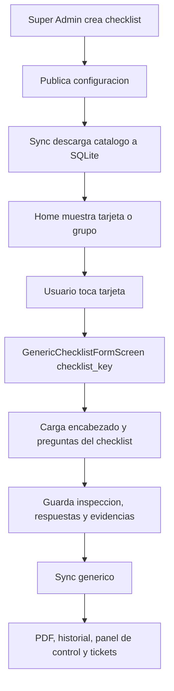
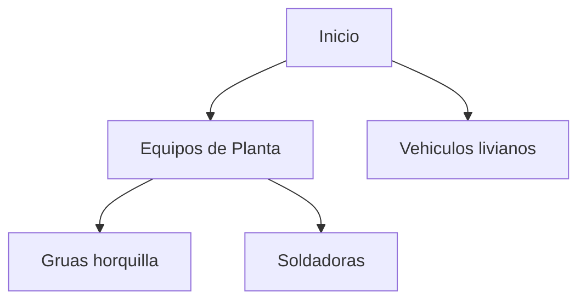
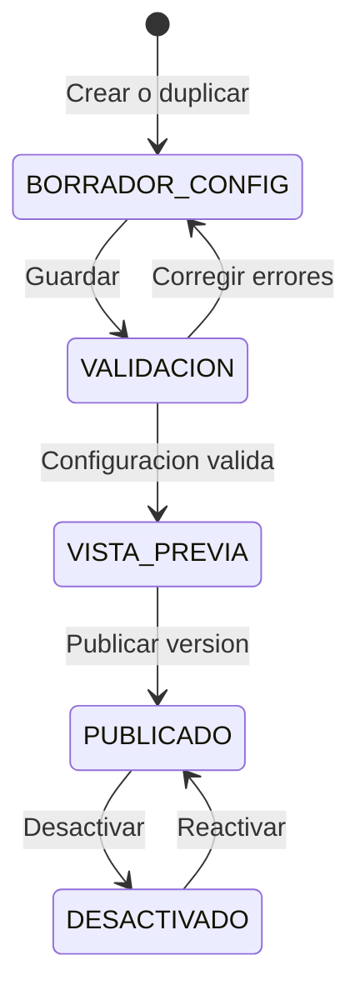
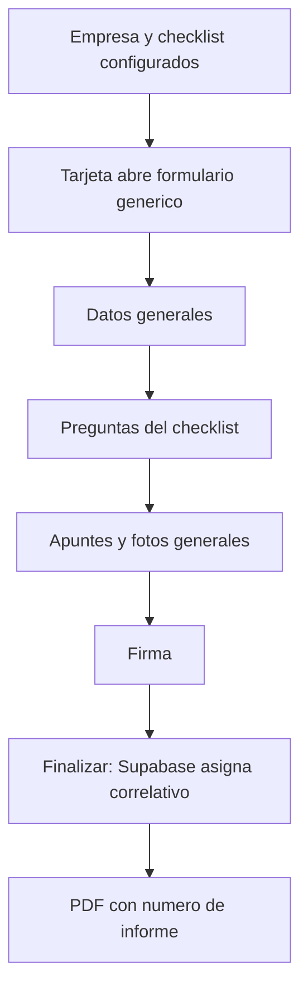

# Plan Maestro: Creador y Motor de Modulos Configurables

Fecha: 2026-09-02
Estado: Listo para diseno de migracion e implementacion por etapas. Este es el
unico plan para el motor que ejecuta los checklists y el panel Super Admin que
los crea.

## Objetivo

Crear un motor reusable para futuros formularios compatibles. Agregar un
checklist nuevo debe ser principalmente configuracion de datos, sin copiar
pantallas, controladores, tablas SQLite ni ramas de sincronizacion.

No se migran ni se reemplazan de inmediato AST, Buceo, Extintores, Hidroser ni
Visitas. El motor nace en paralelo para nuevos checklists compatibles; la
migracion de un modulo existente solo se evalua despues de un piloto estable.

## Flujo que queremos construir

Si, la idea se mantiene: muchos modulos visibles pueden usar la misma pantalla
y el mismo motor. Lo que cambia al tocar una tarjeta es el `checklist_key`.

Ejemplo: "Gruas Horquilla" y "Soldadoras" son dos tarjetas distintas. Ambas
pueden abrir `GenericChecklistFormScreen`, pero con distinto `checklist_key`.
La primera carga `numero_grua` y `horometro`; la segunda, `codigo_equipo`.
Las preguntas son diferentes, pero los borradores, respuestas, fotos, firmas,
sync e informe base se resuelven por el mismo motor.

Un grupo como "Equipos de Planta" no se transmite al formulario: solo ordena
las tarjetas antes de que el usuario elija una.

## Orden de implementacion correcto

No se parte por una interfaz bonita de creador. Primero se construye el motor
que garantiza que toda configuracion publicada funciona. Luego el creador usa
ese motor de manera restringida.

1. Crear tablas nuevas, sync y repositorio generico en paralelo.
2. Crear `GenericChecklistFormScreen` y su controlador para abrir un
   `checklist_key` ya publicado.
3. Probar un checklist sembrado tecnicamente de punta a punta: borrador,
   offline, sync, PDF, historial/RPC y baja logica.
4. Reemplazar la apertura manual de tarjetas nuevas por nodos configurables en
   Home.
5. Agregar la pestana Super Admin `Checklists` para crear borradores de
   configuracion, validar, previsualizar y publicar.
6. Solo despues permitir agrupacion visual, duplicado de checklists y
   administracion diaria desde la interfaz.

El punto 3 es una prueba interna del motor, no significa elegir Vehiculos
Livianos como producto ni migrar ningun modulo actual.

## Las cuatro capas

### 1. Checklist = plantilla reutilizable

Define las preguntas y como se presenta: `checklist_key`, nombre, icono,
color, preguntas, categorias, criticidad, estado activo, tipo de formulario,
campos de encabezado y titulo de PDF.

Ejemplo: "Chequeo de Vehiculos Livianos". Se usa muchas veces, pero es una
sola plantilla.

### 2. Inspeccion = ejecucion concreta

Es el registro que una persona realiza en una fecha. Guarda su `id`,
`checklist_key`, usuario, empresa, estado, correlativo, respuestas, fotos,
firmas, PDF y borrador/sincronizacion. Tambien debe guardar la version y un
snapshot inmutable de la plantilla aplicada al momento de finalizar.

Ejemplo: "Chequeo de camioneta AB-CD-12 del 2 de septiembre". No es un
checklist: es una inspeccion creada a partir de uno.

### 3. Campos de encabezado = definicion y valor

No son una tercera clase de checklist ni se agrupan para la interfaz.

1. La **definicion** pertenece al checklist: `patente`, label "Patente",
   tipo texto, obligatorio.
2. El **valor** pertenece a una inspeccion: `AB-CD-12`.

Si un checklist necesita un dato adicional, se agrega una definicion solo para
ese checklist. Si varios comparten los mismos campos, reutilizan un mismo tipo
de formulario. No se crea un modulo tecnico nuevo solo por un campo extra.

| Checklist | Encabezado base | Campos propios |
| --- | --- | --- |
| Vehiculos livianos | empresa, fecha, inspector | patente, kilometraje, conductor |
| Gruas horquilla | empresa, fecha, inspector | numero_grua, horometro, conductor |
| Soldadora | empresa, fecha, inspector | codigo_equipo |

### 4. Grupo = navegacion visual

Un grupo es una carpeta/tarjeta para ordenar Home. No tiene preguntas, campos,
informes, borradores, PDF ni sincronizacion.

Cambiar una tarjeta desde Inicio a un grupo modifica solo su ubicacion visual;
las inspecciones existentes conservan su `checklist_key`.

## Diseno propuesto

### Motor comun

Un `form_type_key` identifica el comportamiento reutilizable. El motor debe
resolver borradores, SQLite, sync, fotos, firmas, historial, tickets, PDF base
y codigos visibles de soporte.

Solo se crea otro tipo de formulario si cambia un contrato real: respuestas,
firmas, evidencias, regla de finalizacion, correlativo, sync o PDF materialmente
distinto. AST, inmersiones y actividades formativas probablemente requieren su
propio tipo y no deben forzarse en el piloto.

### Checklist configurable

Cada checklist necesita al menos:

| Campo | Uso |
| --- | --- |
| `checklist_key` | Clave inmutable para informes, sync e historial. |
| `form_type_key` | Motor compatible. |
| `permission_key` | Permiso persistible de acceso y administracion. |
| `pdf_template_key` | Plantilla PDF compatible. |
| `report_prefix` | Identificador corto del correlativo, por ejemplo `VL`. |
| `version` | Version de la plantilla; no reemplaza el snapshot historico. |
| `activo` | Desactivar sin borrar datos. |

Las definiciones de preguntas y encabezado se relacionan con `checklist_key`.
Los valores por inspeccion se guardan en `campos_extra` JSONB/TEXT con claves
estables, patron que la app ya utiliza.

### Navegacion por empresa

La configuracion debe modelar nodos por empresa:

| Campo | Uso |
| --- | --- |
| `node_key` | Identificador estable. |
| `empresa_id` | Empresa que lo ve. |
| `parent_node_key` | Grupo padre; nulo equivale a Inicio. |
| `node_type` | `GROUP` o `CHECKLIST`. |
| `checklist_key` | Obligatorio solo para un nodo checklist. |
| `orden`, `habilitado` | Presentacion y activacion. |
| `permission_key` | Restriccion persistible. |

Esta navegacion sustituye gradualmente la lista plana `empresa_modulos`. No se
debe romper el registro actual de modulos especializados durante la transicion.

## Contratos reales encontrados

1. `formulario_items` ya es el catalogo offline de preguntas: identifica sus
   listas mediante `tipo_actividad`, sin llave foranea ni version.
2. `formulario_campos_extra` ya separa bien definicion y valor: la definicion
   tiene `tipo_actividad`, `clave`, `label`, `tipo`, `orden`, `requerido` y
   `activo`; el valor se guarda por inspeccion en `campos_extra` JSON.
3. `empresa_modulos` controla activacion plana por empresa, pero no tiene
   grupos, permiso granular ni navegacion jerarquica.
4. Hidroser y Equipamiento de Buceo tienen catalogo de listas, cabecera,
   respuestas, borradores, fotos, PDF y sync separados; sus repositorios y
   ramas de sync repiten el mismo patron.
5. El Home y borradores son hoy una enumeracion estatica: para cada modulo se
   agregan repositorio, mapeador, tipo de borrador y ruta de apertura. El motor
   nuevo debe resolver esas piezas por `form_type_key`, no por `switch` nuevo.
6. El historial productivo no se lee directo de una vista: pasa por la RPC
   `historial_autorizado`, que aplica autorizacion por usuario/empresa. El
   motor debe agregarse a su fuente de datos y a la RPC, no crear una consulta
   paralela.
7. La descarga de maestros ya carga `formulario_items`,
   `formulario_campos_extra` y `empresa_modulos` a SQLite. Las nuevas tablas
   deben sumarse a ese mismo orden antes de abrir un formulario offline.
8. Verificacion remota del 2026-09-02: las tablas base existen en produccion y
   las nuevas `checklist_*` aun no existen. La migracion puede ser aditiva, sin
   colisionar con datos existentes.
9. La `QuestionCard` actual muestra criticidad siempre que la respuesta es `No
   cumple`. El motor debe ampliar su contrato con reglas configurables
   (`requiere_observacion_nc`, `requiere_foto_nc`, `usa_criticidad` y
   `requiere_criticidad_nc`) antes de reutilizarla.
10. Verificacion remota del 2026-09-02: hay 96 informes historicos sin
    `empresa_id` en `historial_unificado` (40 Inspeccion, 3 Inspeccion
    Extintores y 53 Visita Tecnica). No bloquea el motor nuevo, que debe exigir
    empresa desde la cabecera, pero requiere una correccion de datos separada
    antes de considerar completamente confiable el historial historico por
    empresa.
11. El catalogo remoto tiene 334 preguntas activas en 11 tipos de actividad.
   Todos usan criticidad excepto `MANTENCION_PROSESSO` (9 preguntas). El motor
   no puede asumir criticidad obligatoria o visible por defecto; aplica solo
   cuando la configuracion del checklist la habilita.

## Modelo persistente objetivo

Las tablas se crean nuevas y separadas de las existentes. Esto evita tocar
datos productivos o romper sync de modulos actuales.

### Catalogo y version

1. `checklist_form_types`: contrato tecnico del motor (`form_type_key`, reglas
   de respuesta/foto/firma, `pdf_template_key`, estado y version).
2. `checklists`: identidad estable (`checklist_key`), titulo, icono, color,
   `form_type_key`, permiso requerido, estado y version publicada.
3. `checklist_versions`: snapshot versionado de preguntas y definiciones de
   encabezado. Una inspeccion finalizada referencia esta fila o conserva su
   JSON de snapshot; asi cambiar una plantilla no cambia un informe antiguo.

Para el primer piloto se puede reutilizar `formulario_items` y
`formulario_campos_extra` como origen de edicion, pero al publicar se debe
congelar el snapshot para el informe. No se debe cambiar globalmente
`tipo_actividad` por `checklist_key`: se agrega una relacion nueva compatible
y se migra por etapas.

### Informes genericos

1. `checklist_inspecciones`: cabecera con `id`, empresa, usuario,
   `checklist_key`, `form_type_key`, version/snapshot, fecha, estado,
   correlativo, `campos_extra`, URL/ruta PDF, `subido` y `eliminado` local.
2. `checklist_respuestas`: respuestas por `inspeccion_id` e `item_id`, con
   estado, observacion, criticidad y evidencia asociada.
3. `checklist_evidencias`: metadatos de fotos generales y por respuesta;
   almacenamiento con ruta determinista, no URL construida a mano en cada
   modulo.

Las tablas Supabase usan UUID, FKs e indices por empresa/usuario/estado/
checklist. SQLite refleja los mismos nombres de negocio y agrega solo campos
locales como BLOB de firma, ruta local y `subido`.

### Navegacion y permisos

1. `checklist_navigation_nodes`: arbol por empresa. Un nodo `GROUP` no puede
   tener `checklist_key`; un nodo `CHECKLIST` debe tenerlo. La restriccion debe
   ser un `CHECK` en base de datos.
2. `checklist_permission_grants`: asignacion de capacidades por usuario o rol:
   ver, crear, editar borrador, finalizar y administrar configuracion.

El permiso no se define por cada campo en la primera version. Se valida por
capacidad sobre checklist y empresa, en Supabase y en el espejo local para
buena experiencia offline. La validacion del servidor sigue siendo la fuente
de seguridad.

## Reglas de sincronizacion y seguridad

1. Descargar catalogos, versiones, nodos y permisos antes de permitir crear un
   borrador nuevo. Mantener ultimo catalogo valido si no hay conexion.
2. Subir primero la cabecera, despues respuestas y evidencias, y marcar
   `subido=1` solo cuando todo el conjunto requerido termine correctamente.
3. La baja es logica: `eliminado=1` local y `estado_final='Eliminada'` remoto.
   No borrar historico ni storage sin un proceso administrativo aparte.
4. Los correlativos se asignan en Supabase al finalizar. Usar contador
   transaccional, no una secuencia simple, para evitar los huecos observados
   anteriormente en AST.
5. RLS: el usuario solo puede operar informes de los checklists y empresas que
   tiene autorizados; las respuestas y evidencias heredan autorizacion desde la
   inspeccion padre. Las escrituras administrativas quedan restringidas a
   Super Admin inicialmente.
6. El sync debe registrar y exponer un codigo de error por registro. No puede
   ocultar un error de columna, RLS o conflicto dejando solo `debugPrint`.

## Integracion obligatoria

1. **Borradores:** una fuente generica consulta `checklist_inspecciones`
   pendientes y abre el motor por `form_type_key`; elimina los nuevos `switch`
   por cada checklist.
2. **Historial y panel de control:** agregar una rama a la fuente que alimenta
   `historial_autorizado`, con `empresa_id`, modulo/checklist y contexto. Los
   reportes usan el panel de control, no queries nuevas desde cada formulario.
3. **Tickets:** la politica del checklist indica si genera tickets; los datos
   del informe deben incluir `checklist_key` y version para trazabilidad.
4. **PDF:** el motor llama una estrategia registrada por `pdf_template_key`.
   Primero se extrae marco comun (logo, cabecera, campos, firmas, pie) y se
   deja contenido especializado en estrategias, para no intentar un editor PDF
   libre en la primera entrega.

## Creador Super Admin

### Ubicacion y acceso

Nueva pestana `Checklists` dentro de Administracion. Solo aparece a
`UserSession.esSuperAdmin`; las politicas RLS deben aplicar la misma restriccion
en Supabase. La pestana `Modulos` actual sigue administrando `empresa_modulos`
mientras los modulos existentes no migren al motor.

### Flujo de configuracion

1. **Identidad:** crear `checklist_key` inmutable y elegir un
   `form_type_key` aprobado.
2. **Presentacion:** indicar nombre, subtitulo, icono, color y orden.
3. **Encabezado:** agregar definiciones de campos extra. La cabecera base la
   aporta el motor; un campo adicional pertenece solo a ese checklist.
4. **Preguntas:** definir categorias, preguntas, orden, criticidad y reglas
   soportadas por el tipo de formulario.
5. **Informe:** elegir un `pdf_template_key` compatible. El PDF usa el mismo
   marco base, pero recibe nombre, campos y preguntas del checklist.
6. **Acceso y ubicacion:** asignar empresas, capacidades y nodo de navegacion.
   El checklist puede aparecer directo en Inicio o bajo un grupo.
7. **Previsualizar:** probar formulario y PDF con datos ficticios.
8. **Publicar:** publicar una version completa de forma atomica y dejar la
   anterior disponible para informes historicos.

### Limites iniciales del creador

Puede crear configuraciones que el motor conoce. No puede crear un motor nuevo,
escribir PDF arbitrario, programar sync/RLS/correlativos ni alterar snapshots
publicados. Una necesidad fuera de esos limites es una mejora tecnica del
motor, no una excepcion configurable.

### Via alternativa: crear checklists por SQL de siembra

El panel Super Admin es la etapa 5. Antes de tenerlo, un checklist nuevo se
crea igual sin escribir codigo Dart: se genera un `.sql` de siembra que inserta
la configuracion en las tablas del motor. Es el mismo contrato que usara el
panel, solo cambia quien escribe las filas.

Un archivo de siembra debe insertar, en este orden:

1. `checklists`: identidad, `form_type_key`, `permission_key`, `report_prefix`.
2. `checklist_versions`: snapshot de preguntas, campos y reglas; estado
   `PUBLICADA`.
3. `checklists.published_version` y `activo = true`.
4. `checklist_navigation_nodes`: nodo `CHECKLIST` para cada empresa.
5. `checklist_permission_grants`: capacidades por usuario o rol.

Reglas de esta via:

1. Se entrega un solo `.sql` idempotente por checklist, con `ON CONFLICT`, y se
   ejecuta manualmente en el SQL Editor de Supabase.
2. El archivo parte con un `SELECT` de solo lectura que muestra si el
   `checklist_key` y el `report_prefix` ya existen.
3. Publicar una correccion no edita el snapshot vigente: inserta una version
   nueva y mueve `published_version`.
4. Tras ejecutarlo, la app solo necesita un sync de maestros: la tarjeta y el
   formulario aparecen sin recompilar ni publicar una version nueva.
5. Cuando exista el panel, estos checklists no se migran: ya viven en las
   mismas tablas y quedan editables desde la interfaz.

Esta via es la recomendada para el primer checklist real, porque prueba el
contrato completo del motor antes de invertir en la interfaz de administracion.

### Validaciones antes de publicar

1. Identificadores, permisos y plantilla PDF existen y son compatibles.
2. Hay nombre, preguntas activas y al menos una empresa habilitada.
3. Claves de encabezado son unicas, `snake_case` y de tipo permitido.
4. Ordenes no se repiten dentro de campos, preguntas ni hermanos de navegacion.
5. Un nodo `GROUP` no referencia checklist y no hay ciclos en el arbol.
6. Persistencia local, sync simulado y PDF de prueba pasan antes de publicar.
7. El administrador recibe codigo visible de soporte ante un fallo.

## Reutilizacion existente

1. `formulario_items`: preguntas, categorias, criticidad y orden.
2. `formulario_campos_extra`: definiciones de campos; hoy se liga por tipo de
   actividad y debe evolucionar a `checklist_key`.
3. `campos_extra`: valores por inspeccion, ya persistidos y sincronizados.
4. Hidroser: referencia mas cercana de listas, campos extra, borradores, sync
   y PDF; hoy sigue acoplado a tablas y pantalla propias.
5. `empresa_modulos`: habilitacion actual por empresa.
6. `historial_autorizado`: RPC obligatoria de lectura para el historial
   autorizado por empresa y usuario.

## Reglas obligatorias

1. La configuracion debe existir en Supabase y en espejo SQLite para operar
   offline.
2. Todo checklist y grupo nace con `permission_key` y clave persistible.
3. El panel de control sigue siendo fuente de reportes de actividad; no se
   duplican consultas por checklist.
4. Un grupo nunca es dueño de datos de inspeccion.
5. El PDF recibe el nombre, campos, preguntas y logo del checklist; una nueva
   plantilla solo se crea cuando el formato ya no es compatible.
6. Todo cambio SQLite se agrega en creacion nueva, migracion incremental y
   reparacion de esquema, porque hay dispositivos con upgrades interrumpidos.
7. Ningun SQL del repositorio se aplica solo: antes de ejecutar migracion se
   entrega un check de solo lectura, y el SQL se corre manualmente en el SQL
   Editor de Supabase.
8. El check previo oficial es
   `supabase_check_motor_checklists_configurables_v1.sql`; su resultado se
   revisa antes de generar o ejecutar la migracion.

## Primer entregable recomendado

Una plantilla tecnica de inspeccion estandar, no un modulo de negocio final.
Define campos base, respuestas, firmas, evidencias, correlativo y PDF base que
el creador puede seleccionar. Debe pasar el flujo completo antes de exponer la
interfaz administrativa.

### Contrato visual inicial: lista de chequeo estandar

El PDF "Lista de Chequeo de Esmeril Angular" recibido el 2026-09-02 es la
referencia funcional y visual para la primera plantilla. No define un checklist
unico: el mismo formato debe servir a distintos checklists y empresas.

La configuracion cambia por `checklist_key`:

- nombre y logo de la empresa;
- titulo del informe: `LISTA DE CHEQUEO DE <NOMBRE_CHECKLIST>`;
- preguntas y categorias del checklist;
- campos adicionales de encabezado, si un checklist los necesita;
- nombre/version de plantilla PDF, cuando corresponda.

El flujo de datos del PDF sera:

#### Encabezado fijo de la plantilla

1. Logo y nombre de empresa.
2. Titulo de checklist.
3. Fecha de realizacion.
4. Version de plantilla/checklist.
5. Correlativo, mostrado como `N° de informe`.

El correlativo no lo escribe el usuario: Supabase lo asigna al finalizar y el
PDF definitivo se genera o regenera despues de recibirlo. Debe ser unico y
usar contador transaccional para evitar huecos por reintentos o rollback.

#### Datos generales base

1. Obra o faena.
2. Supervisor a cargo.
3. Correo de supervisor.
4. Region.
5. Area especifica.
6. Jefatura a cargo.
7. Hora de inicio.
8. Hora de termino.
9. Correo empresa 1 para enviar informe.
10. Correo empresa 2 para enviar informe, opcional.

El nombre y correo de supervisor deben ser campos propios de la inspeccion,
editables aunque el telefono use un usuario general. El usuario autenticado se
guarda aparte como responsable de crear/finalizar el registro para auditoria;
no se usa como sustituto del supervisor indicado en el informe.

#### Cuerpo fijo de la plantilla

1. Tabla de preguntas del checklist: numero, descripcion y resultado usando
   las `QuestionCard` ya probadas en la aplicacion y el orden por categorias
   usado en Equipamiento de Buceo.
2. Apuntes u observaciones generales de texto libre.
3. Galeria de fotos generales, con orden persistido.
4. Una firma final de quien realiza la inspeccion, con nombre editable.
5. Pie con empresa emisora, telefono, version de app/plantilla y numero de
   pagina.

#### Campos adicionales por checklist

La plantilla no obliga a que todos los checklists tengan exactamente el mismo
encabezado. Por ejemplo, un checklist puede pedir patente y kilometraje, y otro
puede pedir codigo de equipo. Esos campos se agregan debajo de los datos
generales desde su definicion de checklist, mientras el PDF los imprime en la
misma seccion sin requerir una pantalla distinta.

### Decisiones confirmadas para la primera plantilla

#### Respuestas y tarjetas

1. Cada pregunta usa las mismas `QuestionCard` existentes: `Cumple`, `No
   cumple` y `No aplica`.
2. Se reutiliza el orden por categoria que ya funciona en el checklist de
   Equipamiento de Buceo.
3. Cada checklist configura sus propias reglas al momento de publicarse. Como
   minimo, la configuracion tiene tres interruptores independientes para
   definir si al marcar `No cumple` se exige: observacion, foto y criticidad.
4. La criticidad se mantiene seleccionable por quien realiza la inspeccion
   cuando el checklist la habilita. El creador puede deshabilitarla o fijarla
   desde la configuracion de cada pregunta/checklist cuando corresponda.

La misma tarjeta recibe las reglas configuradas por el `checklist_key`; no se
crean pantallas distintas para combinaciones distintas de requisitos.

#### Fotos

1. Una pregunta puede tener su propia foto de evidencia.
2. La inspeccion tambien conserva una galeria de fotos generales al final.
3. La configuracion de cada pregunta indica si su foto es opcional u
   obligatoria al marcar `No cumple`.

#### Presentacion de resultados en PDF

1. `Cumple`: etiqueta verde.
2. `No cumple`: etiqueta roja; muestra observacion, criticidad y foto cuando
   existan o sean obligatorias.
3. `No aplica`: etiqueta gris.
4. El color complementa el texto, no es la unica forma de distinguir el
   resultado en el informe.

#### Firma

1. En la primera plantilla firma solamente quien realiza la inspeccion.
2. Su nombre se precarga desde el campo superior "Quien realiza la
   inspeccion", pero se puede editar antes de firmar.
3. El PDF imprime la imagen de firma y el nombre finalmente usado. El usuario
   autenticado sigue guardandose para auditoria, aunque use un usuario general.
4. La arquitectura conserva la posibilidad de que una futura plantilla
   configure una o mas firmas, como el patron actual de Grua Horquilla, sin
   cambiar inspecciones ya creadas.

#### Numero de informe

1. Cada checklist define un `report_prefix` unico, por ejemplo `VL` para
   Vehiculos Livianos.
2. El encabezado muestra `N° Informe <report_prefix>-<numero>`, por ejemplo
   `N° Informe VL-0001`.
3. El numero se asigna en Supabase al finalizar, no al crear el borrador.
4. El contador es independiente por checklist y no se reinicia por anio:
   `VL-0001`, `VL-0002`; otro checklist puede comenzar en `EA-0001`.
5. El contador debe ser transaccional, unico por `checklist_key` y sin
   reutilizar numeros aun si una inspeccion se elimina logicamente.

La publicacion valida que `report_prefix` use mayusculas, numeros o guion, y
que no se repita entre checklists activos. El formato recomendado usa cuatro
digitos para facilitar orden y lectura, aunque el contador puede crecer sin
limite: `VL-9999`, `VL-10000`.

#### Encabezado extensible

Los datos generales definidos se mantienen como base. Cada checklist puede
agregar sus propios campos, por ejemplo matricula, patente, codigo de equipo,
marca o modelo. Agregar uno de esos campos debe ser configuracion desde el
creador; no requiere otra pantalla ni otra tabla de inspecciones.

#### Entrega del informe

La primera fase solo sube el PDF y el informe terminado, y lo muestra en el
historial existente mediante `historial_autorizado` y el panel de control. No
prepara ni envia correos automaticamente. El uso de los dos correos de
encabezado queda reservado para la fase posterior de correo/Outlook.

#### Confirmaciones pendientes antes de implementar

No hay decisiones funcionales bloqueantes para la primera plantilla. La
siguiente etapa es disenar la migracion y el contrato tecnico del motor.

## Implementacion por etapas

1. **Diseno y prueba de datos:** cerrar contrato de la plantilla estandar,
   permisos, correlativo y PDF; crear SQL consolidado de check, migracion y
   pruebas.
2. **Esquema paralelo:** crear tablas Supabase + SQLite y sincronizar catalogos
   sin exponer aun el modulo a usuarios.
3. **Motor minimo:** formulario generico, borrador, respuestas, evidencias,
   error visible y sync de una plantilla estandar aprobada.
4. **Navegacion:** abrir el formulario generico desde tarjetas/nodos de datos,
   incluir borradores, historial/RPC, panel de control y tickets si corresponde.
5. **Primer checklist por siembra:** publicar un checklist real con un `.sql` de
   siembra y validarlo de punta a punta antes de construir la interfaz.
6. **Creador restringido:** panel Super Admin para configurar checklist,
   encabezado, preguntas, permisos, empresa y navegacion.
7. **Endurecimiento:** pruebas offline, RLS, conflicto de sync, PDF, baja
   logica y upgrade desde bases SQLite antiguas.
8. **Generalizacion:** solo despues de una publicacion real exitosa desde el
   creador, decidir que familias existentes vale la pena migrar.

## Riesgos que se aceptan y mitigaciones

| Riesgo | Mitigacion |
| --- | --- |
| Un SQL existe pero no fue ejecutado en produccion | Check previo, migracion idempotente y pruebas SQL; ejecucion manual confirmada. |
| Campo nuevo rompe sync con error de columna | Contrato de columnas compartido, prueba de upsert y codigo visible de error. |
| RLS bloquea una escritura sin excepcion util | Verificar filas afectadas y probar politicas con usuario autenticado. |
| Cambio de plantilla altera un informe historico | Version y snapshot al finalizar; PDF se genera desde el snapshot. |
| Refactor masivo rompe modulos estables | Tablas y motor nuevos en paralelo; no migrar modulos existentes en el piloto. |
| Catalogo no disponible offline | Espejo SQLite y ultimo catalogo valido descargado. |

## Preguntas para cerrar con tu tio

1. Confirmar que dos checklists con encabezados distintos pueden compartir el
   mismo motor y PDF base, apareciendo como tarjetas independientes.
2. Definir que campos base, firmas, fotos y reglas incluye la primera plantilla
   tecnica de inspeccion estandar.
3. Definir el primer grupo de navegacion y los checklists que contendra.
4. Definir quien crea, edita, ordena, activa y desactiva grupos, checklists,
   preguntas y campos. Recomendacion inicial: solo Super Admin.
5. Decidir si una empresa puede editar preguntas globales o solo asignar un
   catalogo central versionado. Recomendacion: catalogo central + asignacion.
6. Confirmar que los cambios de preguntas/campos aplican a nuevas inspecciones
   sin reescribir los informes historicos.

## Siguiente paso al aprobar

Crear un plan de implementacion por etapas y un SQL unico con chequeo de solo
lectura, migracion idempotente, pruebas posteriores e instrucciones para
ejecutarlo manualmente en el SQL Editor de Supabase. Antes de editar codigo se
deben reutilizar las funciones existentes de SQLite, sync, PDF, tickets y panel
de control.