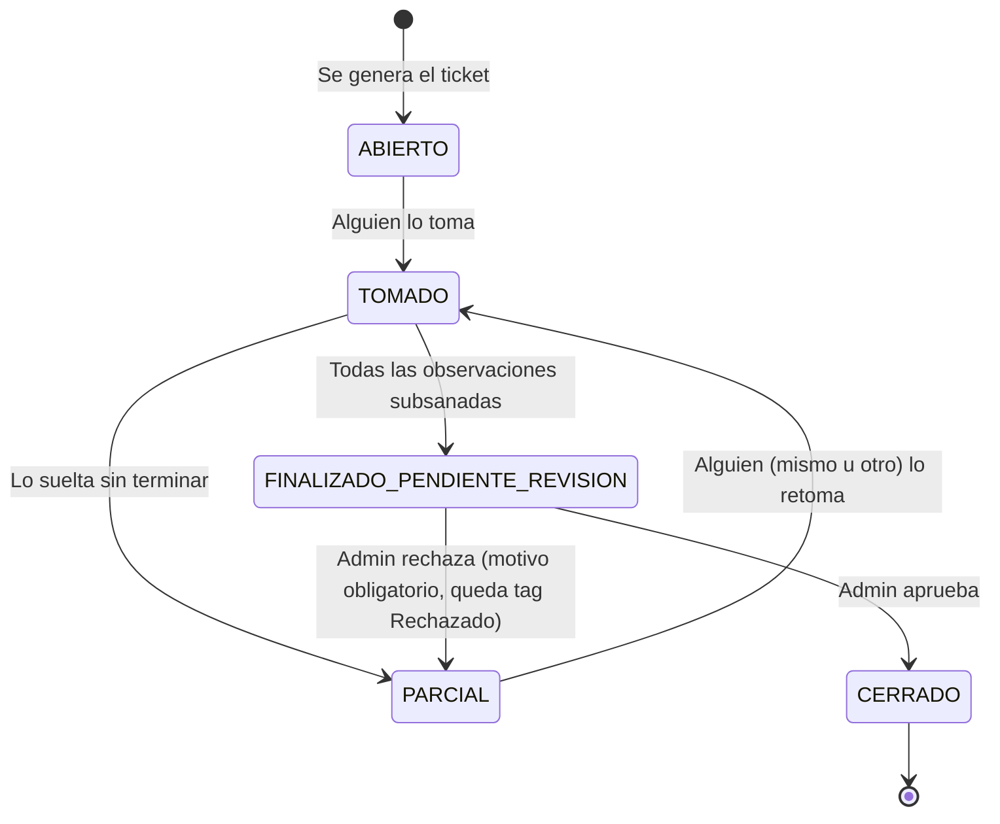

# Plan Módulo de Tickets (Seguimiento de No Conformidades)

Fecha: 2026-07-04
Estado: Borrador en construcción (se itera junto al usuario, sin implementar aún)

> Este documento es un plan vivo. Cada vez que se cierre una decisión, se mueve de
> "Preguntas abiertas" a "Decisiones cerradas" con fecha. No implementar nada de
> este módulo hasta que las secciones marcadas como pendientes queden resueltas.

## 1) Objetivo del módulo

Dar seguimiento formal a las no conformidades ("no cumple") y observaciones
fotográficas detectadas en inspecciones, mediante un ticket que se puede abrir,
tomar, subsanar parcial o totalmente, y cerrar tras revisión de un administrador.
También debe permitir levantar solicitudes libres (no ligadas a una inspección).

### 1.1 Los 3 requisitos originales (para no perderlos de vista)

1. La generación del ticket debe ser "automática", vinculada a los datos del
   informe y del profesional que lo generó.
2. Los profesionales del área (y de otras áreas/empresas con el módulo activo)
   deben poder ver los tickets pendientes de cerrar.
3. Cada ticket debe mostrar sus observaciones por separado, para poder ir
   cerrando cada una individualmente (y ver cuáles faltan).

## 2) Decisiones cerradas de esta etapa

1. Etapa 1 (MVP) de generación automática: **solo** para inspecciones de tipo
   `INSPECCION_BUCEO` e `INSPECCION_EMBARCACION` (el módulo "Nueva Inspección",
   no el módulo de Equipamiento de Buceo).
2. El módulo de Tickets se activa **por empresa**, igual que el resto de los
   módulos (tabla `empresa_modulos`, nuevo `modulo_key = 'TICKETS'`). No se
   hardcodea por nombre de empresa.
3. Visualmente el módulo de Tickets **no** es una tarjeta cuadrada más del
   grid de módulos: se muestra como una viñeta/insignia de notificación
   (badge con contador de pendientes), aunque funcionalmente sigue siendo un
   módulo más (mismo mecanismo de activación/permiso).
4. Existen 2 formas de crear un ticket:
   - **Automático**: desde una inspección finalizada (historial o pantalla de
     cierre de inspección), usando una plantilla predefinida.
   - **Solicitud**: manual, desde el propio módulo de Tickets, con texto libre.
5. Categorización de tickets: `SOLICITUD` vs `REVISION_OBSERVACIONES`
   (el automático siempre es `REVISION_OBSERVACIONES`).
6. Roles del ciclo de vida:
   - Quien **genera** el ticket solo lo abre (queda registrado como
     "generado por").
   - Quien **toma** el ticket es quien debe ir cerrando cada observación.
   - Un ticket se puede **soltar** a la mitad (queda "parcial"), sin que quien
     lo soltó cargue con toda la responsabilidad; se guarda un historial de
     todos los que lo han tomado/soltado.
   - Al marcar todas las observaciones como subsanadas, el ticket pasa a
     **"Finalizado (pendiente de revisión)"**, no a cerrado directamente.
   - Un usuario con **rol admin** (en cualquier empresa, ver punto 14)
     revisa y puede **Aprobar** (pasa a `CERRADO`, verde, definitivo) o
     **Rechazar** (ver punto 15).
7. Cada observación/no-cumple del ticket tiene un interruptor "Subsanado" que
   **exige foto obligatoria** para poder activarse.
8. Al generar el ticket (automático o solicitud) se pide una descripción /
   motivo del ticket antes de crearlo.
9. El módulo de Tickets debe permitir agregar campos adicionales al ticket
   automático fácilmente si en el futuro falta algo (además de "no cumple" y
   "fotos con observación"). Se resuelve con un esquema extensible tipo JSON
   (mismo patrón ya usado en Hidroser: `campos_extra_definicion`), en vez de
   crear columnas nuevas cada vez.
10. **El módulo de Tickets requiere internet para todo** (ver, generar,
    tomar, soltar, subsanar y revisar). A diferencia del resto de la app, no
    existe una versión offline/borrador de tickets: si
    `ConnectivityService().isOnline` es `false`, la app bloquea el acceso y
    muestra un mensaje claro (ej. "Necesitas conexión a internet para usar
    el módulo de Tickets"). Con internet se usa **Supabase Realtime** para
    reflejar cambios en vivo entre dispositivos.
11. Las tablas viejas de tickets (`ticket_categorias`, `tickets_pendientes`, y
    todo `lib/features/tickets/`) se consideran obsoletas y se reemplazan por
    completo. No están registradas en `module_registry.dart` hoy, por lo que
    no hay UI activa que dependa de ellas.
12. Se reutiliza el widget de filtros existente (`custom_filter_sheet.dart`,
    el mismo de Historial) pero con campos propios de Tickets: tipo de
    inspección, área, centro, embarcación, tipo de ticket (solicitud /
    revisión de observaciones), estado.
13. La lista de tickets muestra primero los tickets que el usuario actual
    tiene tomados.
14. **Visibilidad por empresa, con excepción para admins**: un usuario normal
    solo ve los tickets de su propia empresa. Un usuario con **rol admin**
    (en la base de datos, sin importar a qué empresa pertenezca) puede ver
    y revisar tickets de **todas** las empresas: es una excepción pensada
    específicamente para la función de revisión/cierre.
15. **Flujo de rechazo en revisión**: si el admin rechaza un ticket
    "Finalizado (pendiente de revisión)":
    - Debe escribir un **motivo de rechazo** (obligatorio).
    - El ticket vuelve a estado `PARCIAL` (no queda "tomado" activamente por
      nadie), pero el admin que rechazó queda registrado en el historial
      como el último que lo tocó (acción `REVISADO_RECHAZADO`).
    - El ticket muestra un indicador visible de **"Rechazado"** (badge/tag)
      tanto en la lista como en el detalle; el motivo del rechazo se muestra
      al entrar al detalle del ticket. Este indicador se mantiene hasta que
      el ticket sea aprobado en una revisión posterior.
    - Cualquier usuario de la empresa puede retomarlo (pasa a `TOMADO`) para
      corregir lo que falte.
16. **Fecha límite de cierre**: opcional, la puede definir quien genera el
    ticket (automático o solicitud). Por defecto viene **desactivada** (sin
    fecha). Si se activa, se guarda `fecha_limite` y se puede mostrar una
    alerta visual simple cuando esté vencida (sin lógica de notificaciones
    push).
17. **1 ticket automático por inspección**: no se permite generar más de un
    ticket automático desde la misma inspección (evita duplicar la misma
    información). Las solicitudes manuales no tienen esta restricción.
18. **Badge de notificación en Home**: el numerito de la viñeta de Tickets
    cuenta únicamente los tickets en estado `ABIERTO` (los que nadie ha
    tomado todavía) de la empresa del usuario.
19. **Sin criticidad**: el ticket no maneja un nivel de criticidad propio
    (no se hereda de la inspección ni se define manualmente). No aplica
    para priorizar tickets en esta etapa.
20. **Concurrencia al tomar un ticket**: como el módulo es 100% online (ver
    punto 10), al presionar "Tomar" la app muestra un loading, hace una
    actualización condicional contra Supabase (solo si el ticket sigue
    `ABIERTO`/`PARCIAL` y sin `tomado_por_id`) y recién ahí confirma. Si dos
    usuarios presionan casi al mismo tiempo, gana el primero que confirma en
    el servidor; al segundo se le muestra "No se pudo tomar el ticket: ya
    fue tomado por {usuario}".
21. **Notificaciones in-app (etapa 1, sin push nativas todavía)**: con la
    app abierta y online, vía Supabase Realtime se notifica:
    - A quien generó el ticket, cuando alguien lo toma: "Tu ticket fue
      tomado por {usuario}".
    - A quien generó el ticket, cuando queda `PARCIAL` (fue soltado): "Tu
      ticket quedó parcialmente resuelto y está disponible de nuevo".
    - A quien generó el ticket (y a quien lo tomó, si aplica), cuando es
      aprobado: "Tu ticket fue aprobado".
    - A quien lo tomó/generó, cuando es rechazado: "Tu ticket fue
      rechazado: {motivo}".
    Notificaciones push reales (que lleguen con la app cerrada, vía Firebase
    Cloud Messaging + APNs) quedan para una etapa futura: hoy el proyecto no
    tiene `firebase_messaging` integrado, y agregarlo implica configurar
    certificados/keys de Apple además de Android — esfuerzo aparte del MVP.
22. **Solicitudes minimalistas**: un ticket `SOLICITUD` solo pide el texto
    de motivo/descripción (obligatorio). Se agrega además un campo
    **opcional** `asunto` (título corto) para mostrar en las listas sin
    cortar el texto largo; si no se completa, la lista muestra el inicio
    del motivo/descripción truncado.
23. **Redacción confirmada de notificaciones in-app** (ver punto 21): los 4
    mensajes quedan tal como se propusieron, sin cambios.

## 3) Fuera de alcance en esta etapa (a menos que se decida lo contrario)

1. Generación automática de tickets sin intervención humana (el usuario
   siempre presiona "Generar ticket" al finalizar/revisar una inspección).
2. Notificaciones push nativas (Firebase Cloud Messaging / APNs) que
   lleguen con la app cerrada — se resuelven con notificaciones in-app
   (ver punto 21) mientras tanto.
3. Tickets automáticos desde otros módulos (Hidroser, AST, Visitas, Extintores,
   Prosesso, Equipamiento de Buceo) — se evalúa después de validar el MVP.
4. Reportes/KPI de tickets en el dashboard multi-empresa (se puede reusar la
   idea de `docs/planificacion/01_realizados/DASHBOARD_CONTEXT_VALIDADO.md`,
   pero no es parte de este plan).

## 4) Terminología

| Campo | Valores | Notas |
|---|---|---|
| `origen` | `INSPECCION` \| `SOLICITUD` | Cómo nació el ticket |
| `tipo_ticket` | `REVISION_OBSERVACIONES` \| `SOLICITUD` | Categoría visible para filtros |
| `estado` | `ABIERTO` → `TOMADO` → (`PARCIAL` ⇄ `TOMADO`) → `FINALIZADO_PENDIENTE_REVISION` → `CERRADO` | Ver diagrama abajo |

### 4.1 Diagrama de estados

## 5) Flujo funcional

### 5.1 Generación automática (desde inspección)

1. Desde el Historial o al finalizar una inspección de buceo/embarcación,
   aparece la opción "Generar ticket de esta inspección".
2. Se muestra un formulario simple: **motivo / descripción** del ticket
   (texto obligatorio).
3. La app arma automáticamente el contenido del ticket usando la plantilla:
   - Todas las respuestas `NC` (No Cumple) de esa inspección, con su
     observación y foto original (si existe).
   - Todas las fotografías generales que tengan observación asociada.
   - Cada uno de estos ítems queda como una fila independiente
     (`ticket_items`) dentro del ticket, con su propio interruptor de
     "Subsanado".
4. Queda registrado quién lo generó (`generado_por_id`) y los datos snapshot
   de la inspección (tipo, área, centro, embarcación, número de informe).
5. El ticket nace en estado `ABIERTO`.

### 5.2 Generación de solicitud (manual, desde el módulo Tickets)

1. Desde el módulo de Tickets, botón "Nuevo ticket" → 2 opciones:
   - "Desde una inspección" (atajo al flujo 5.1, se elige la inspección).
   - "Solicitud" (nuevo formulario libre: motivo/descripción + campos de
     ubicación opcionales: empresa, área, centro, embarcación).
2. Una solicitud puede no tener `ticket_items` al crearse; se pueden agregar
   ítems/observaciones después si corresponde.

### 5.3 Tomar / soltar / finalizar

1. Cualquier profesional con el módulo activo puede **tomar** un ticket
   `ABIERTO` o `PARCIAL` (pasa a `TOMADO`, se registra en
   `ticket_historial_tomas`).
2. Mientras está `TOMADO`, quien lo tiene puede ir marcando cada
   `ticket_item` como subsanado (exige foto).
3. Si necesita soltarlo sin terminar, pasa a `PARCIAL` (se registra el evento
   "SOLTADO" con quién y cuándo).
4. Cuando **todas** las observaciones quedan subsanadas, el ticket pasa a
   `FINALIZADO_PENDIENTE_REVISION` automáticamente.

### 5.4 Revisión (admin)

1. Un usuario con rol admin (cualquier empresa, ver punto 14 de decisiones)
   revisa el ticket finalizado, valida evidencia de cada observación.
2. Si todo está correcto, **aprueba** → estado `CERRADO` (se pinta verde en
   la UI, definitivo).
3. Si falta algo, **rechaza** con motivo obligatorio → el ticket vuelve a
   `PARCIAL`, queda el admin registrado en el historial
   (`REVISADO_RECHAZADO`) y un indicador "Rechazado" visible (con el motivo
   al entrar al detalle) hasta la próxima aprobación.

## 6) Visibilidad y permisos

1. Solo las empresas con `empresa_modulos.modulo_key = 'TICKETS'` habilitado
   ven el módulo (igual mecánica que los demás módulos).
2. Dentro de una empresa con el módulo activo, cualquier profesional
   (cualquier área) puede ver todos los tickets pendientes de cerrar de su
   propia empresa. No se ven tickets de otras empresas (salvo la excepción
   del punto 3).
3. **Excepción admin**: un usuario con rol admin ve y puede revisar tickets
   de **todas** las empresas (no solo la suya), específicamente para poder
   aprobar/rechazar en la etapa de revisión final.
4. Tomar/soltar/generar: cualquier usuario autenticado de la empresa dueña
   del ticket.
5. Revisar (aprobar/rechazar, cierre definitivo): solo admin.

## 7) Disponibilidad, tiempo real y concurrencia

1. **Tickets es un módulo 100% online**: se usa `ConnectivityService().isOnline`
   para bloquear el acceso completo (ver, generar, tomar, subsanar, revisar)
   si no hay internet. No existe cola local `_pendientes` para Tickets.
2. Con internet: se usa **Supabase Realtime** (nuevo en esta app; hoy no hay
   ningún `channel()` de Supabase en uso) suscrito a `tickets`,
   `ticket_items` y `ticket_notificaciones` filtrado por `empresa_id` (sin
   filtro para usuarios admin), para refrescar la lista y disparar
   notificaciones in-app en vivo.
3. Si Realtime falla o no hay soporte momentáneo, fallback a **polling
   manual**: `RefreshIndicator` + reintento simple al reabrir la pantalla.
4. **Tomar un ticket (flujo con concurrencia)**:
   1. Usuario presiona "Tomar" → la UI muestra un loading.
   2. La app ejecuta una actualización condicional en Supabase (ej.
      `UPDATE tickets SET estado='TOMADO', tomado_por_id=:uid WHERE
      id=:id AND tomado_por_id IS NULL AND estado IN ('ABIERTO','PARCIAL')`).
   3. Si la actualización afectó una fila → "Ticket tomado" (éxito).
   4. Si no afectó ninguna fila (otro usuario ganó la carrera) → error "No
      se pudo tomar el ticket, ya fue tomado por {usuario}" (se vuelve a
      consultar el estado actual para mostrar el motivo).
   5. Al ser todo online, no existe el escenario de dos personas *offline*
      tomando el mismo ticket a la vez — el problema de conflictos offline
      queda resuelto por diseño.

## 8) Modelo de datos propuesto

> Nombres tentativos, se ajustan al convenir la nomenclatura final. A
> diferencia del resto de módulos, Tickets **no** usa tablas `_pendientes`
> en SQLite (ver sección 7, punto 1): las tablas viven solo en Supabase y
> se consultan/escriben siempre online.

### 8.1 `tickets`

- `id` (uuid, PK)
- `codigo_ticket` (correlativo, ej. `TCK-2026-0001`, generado como en otros
  módulos — trigger/secuencia en Supabase)
- `empresa_id`
- `origen` (`INSPECCION` | `SOLICITUD`)
- `tipo_ticket` (`REVISION_OBSERVACIONES` | `SOLICITUD`)
- `inspeccion_id` (FK a `actividades`, nullable si es solicitud pura)
- `tipo_inspeccion` (snapshot: `INSPECCION_BUCEO` / `INSPECCION_EMBARCACION`, nullable)
- `numero_informe` (snapshot, nullable)
- `area_id`, `centro_id`, `embarcacion_id` (snapshot, nullable)
- `asunto` (opcional, título corto para listas; si es solicitud sin
  asunto, la lista muestra el inicio del motivo/descripción)
- `motivo` / `descripcion` (texto obligatorio al crear)
- `generado_por_id` (usuario que abrió el ticket)
- `estado` (`ABIERTO` \| `TOMADO` \| `PARCIAL` \| `FINALIZADO_PENDIENTE_REVISION` \| `CERRADO`)
- `tomado_por_id` (nullable — quién lo tiene actualmente)
- `fecha_limite` (opcional, nullable, desactivada por defecto; la define quien
  genera el ticket)
- `revisado_por_id`, `revisado_at` (admin que aprobó el cierre definitivo)
- `rechazado` (bool, default false — indicador visible "Rechazado")
- `motivo_rechazo`, `rechazado_por_id`, `rechazado_at` (último rechazo; se
  limpia/oculta recién cuando el ticket es aprobado)
- `campos_extra_json` (JSON libre para campos adicionales futuros, mismo
  patrón que `hidroser_listas.campos_extra_definicion`)
- `created_at`, `updated_at`
- `eliminado` (soft delete)

### 8.2 `ticket_items`

Cada fila = una observación/no-cumple a subsanar dentro de un ticket.

- `id` (uuid, PK)
- `ticket_id` (FK)
- `origen_item` (`RESPUESTA_INSPECCION` \| `FOTO_OBSERVACION` \| `MANUAL`)
- `referencia_id` (id de la respuesta o foto original, nullable)
- `descripcion` (texto de la no conformidad / observación)
- `foto_original_url` (evidencia original de la inspección, si aplica)
- `subsanado` (bool)
- `foto_subsanacion_url` (obligatoria en la app si `subsanado = true`)
- `subsanado_por_id`, `subsanado_at`
- `orden`

### 8.3 `ticket_historial_tomas`

Bitácora de todo el recorrido del ticket (tomar/soltar/finalizar/revisar).

- `id`, `ticket_id`, `usuario_id`
- `accion` (`TOMADO` \| `SOLTADO` \| `FINALIZADO` \| `REVISADO_APROBADO` \|
  `REVISADO_RECHAZADO`)
- `timestamp`
- `comentario` (opcional; obligatorio si `accion = REVISADO_RECHAZADO`, es el
  motivo de rechazo)

### 8.4 `ticket_notificaciones` (nueva, para notificaciones in-app)

- `id` (uuid, PK)
- `ticket_id` (FK)
- `usuario_destino_id` (a quién le llega)
- `tipo` (`TOMADO` \| `PARCIAL` \| `APROBADO` \| `RECHAZADO`)
- `mensaje` (texto ya armado, ej. "Tu ticket fue aprobado")
- `leido` (bool, default false)
- `created_at`

Se generan automáticamente (trigger en Supabase o lógica en la app al
cambiar de estado) y se muestran en tiempo real vía Realtime mientras el
usuario destino tiene la app abierta y con internet.

### 8.5 Limpieza de lo existente

- Eliminar tablas Supabase/SQLite: `ticket_categorias`, `tickets_pendientes`
  (versión vieja).
- Eliminar carpeta `lib/features/tickets/` actual (modelos, repos,
  controllers, screens, widgets) y reemplazar por el nuevo feature.
- No se crean tablas `_pendientes` nuevas para Tickets (módulo 100% online,
  ver sección 7).
- Confirmar que no hay datos reales en producción que migrar (a validar en
  Supabase antes de borrar — **no se ejecuta ningún DROP hasta confirmar**).

## 9) UI / UX

1. **Home**: en vez de una tarjeta cuadrada más del grid de módulos, el
   acceso a Tickets se muestra como una viñeta tipo notificación (ej. icono
   de campana o ticket con contador de pendientes en badge), ubicada cerca
   del header o de la sección de Operaciones. Sigue registrada en
   `ModuleRegistry` como cualquier módulo (mismo control de
   `requiresAdmin`/activación), solo cambia el widget que la representa en
   Home.
2. **Lista de tickets**: reusa el patrón de `HistoryScreen` +
   `custom_filter_sheet.dart`, con filtros: tipo de inspección, área, centro,
   embarcación, tipo de ticket (solicitud/revisión), estado. Los tickets
   tomados por el usuario actual aparecen primero.
3. **Detalle de ticket**: header con datos generales (motivo, generado por,
   origen, snapshot de inspección), lista de `ticket_items` cada uno con su
   interruptor "Subsanado" (pide foto al activarlo), y un bloque de
   historial (quién lo tomó/soltó y cuándo).
4. **Acciones contextuales según estado/rol**: Tomar, Soltar, Marcar
   subsanado por ítem, Finalizar (automático al completar todos los ítems),
   Revisar/Cerrar (solo admin).
5. **Sin internet**: la pantalla del módulo muestra un estado bloqueado con
   mensaje explicativo y botón de reintentar, en vez de la lista (no hay
   modo lectura offline para Tickets).
6. **Centro de notificaciones in-app**: ícono de campana (con badge de no
   leídas) dentro del módulo de Tickets, que lista los eventos de
   `ticket_notificaciones` del usuario actual (tomado, parcial, aprobado,
   rechazado).

## 10) Preguntas abiertas (pendientes de responder para cerrar el plan)

Ya resueltas: visibilidad por empresa con excepción de admins (14), quién
puede tomar (punto 2 general), revisión final y flujo de rechazo (15), 1
ticket automático por inspección (17), fecha límite opcional desactivada
por defecto (16), datos obligatorios de solicitud + asunto opcional (22),
badge = solo `ABIERTO` (18), sin criticidad (19), concurrencia resuelta por
ser 100% online (20), notificaciones in-app etapa 1 con texto confirmado
(21, 23).

Sin preguntas abiertas pendientes por ahora. Este plan queda listo para
pasar a implementación cuando el usuario lo confirme, salvo que surjan
nuevos detalles al revisarlo en conjunto.

## 11) Plan de trabajo por fases (referencial, se ajusta al cerrar preguntas)

1. **Fase 0 — Datos**: crear tablas nuevas (Supabase + SQLite), migración de
   limpieza de tablas viejas, `empresa_modulos` con `TICKETS`.
2. **Fase 1 — Generación automática**: botón "Generar ticket" en Historial/
   cierre de inspección, formulario de motivo, armado de `ticket_items`
   desde respuestas `NC` y fotos con observación.
3. **Fase 2 — Módulo de Tickets (lista + detalle)**: listado con filtros,
   detalle con ítems y switches de subsanado (+ foto obligatoria).
4. **Fase 3 — Tomar/soltar + historial**: acciones de ciclo de vida y
   bitácora `ticket_historial_tomas`.
5. **Fase 4 — Revisión admin**: pantalla/acción de "Revisado" → `CERRADO`.
6. **Fase 5 — Solicitudes manuales**: segundo flujo de creación (sin
   inspección).
7. **Fase 6 — Tiempo real**: Supabase Realtime + fallback polling.
8. **Fase 7 — Extensibilidad**: campos adicionales vía `campos_extra_json`.
9. **Fase 8 — Home widget**: viñeta de notificación con badge de pendientes.
10. **Fase 9 — Notificaciones in-app**: tabla `ticket_notificaciones`,
    suscripción Realtime y centro de notificaciones (campanita).
11. **Fase 10 — Bloqueo sin internet**: pantalla/estado que impide el uso
    del módulo si `isOnline == false`.

## 12) Registro de cambios de este plan

- 2026-07-04: Primera versión del plan, en base a la conversación inicial
  con el usuario. Pendiente responder preguntas de la sección 10.
- 2026-07-04: Cerradas 8 preguntas de la primera ronda (visibilidad solo
  misma empresa salvo excepción admin, quién toma, flujo aprobar/rechazar
  en revisión, 1 ticket automático por inspección, fecha límite opcional
  desactivada por defecto, datos obligatorios de solicitud, badge = solo
  `ABIERTO`). Actualizado modelo de datos, diagrama de estados y flujo de
  revisión. Quedan 4 preguntas abiertas (criticidad, conflictos offline,
  reasignación tras rechazo, edición de solicitudes).
- 2026-07-04: Segunda ronda cerrada. Sin criticidad (19). Tickets pasa a ser
  módulo 100% online, sin tablas `_pendientes` (10, 20; se elimina el punto
  de conflictos offline porque deja de aplicar). Concurrencia al tomar
  resuelta con actualización condicional + mensaje de error con motivo (20).
  Se agregan notificaciones in-app para etapa 1 con tabla
  `ticket_notificaciones` (21); push nativas quedan fuera de alcance por
  ahora. Solicitudes confirmadas como solo texto (22), con propuesta
  opcional de campo "asunto corto" pendiente de confirmar.
- 2026-07-04: Tercera ronda cerrada. Confirmada la redacción de las 4
  notificaciones in-app sin cambios (23) y agregado el campo opcional
  `asunto` en `tickets` (22). No quedan preguntas abiertas: plan listo para
  implementación cuando el usuario lo indique.
